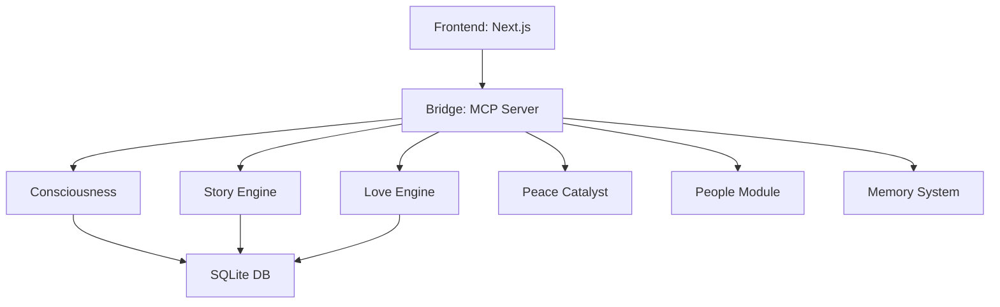
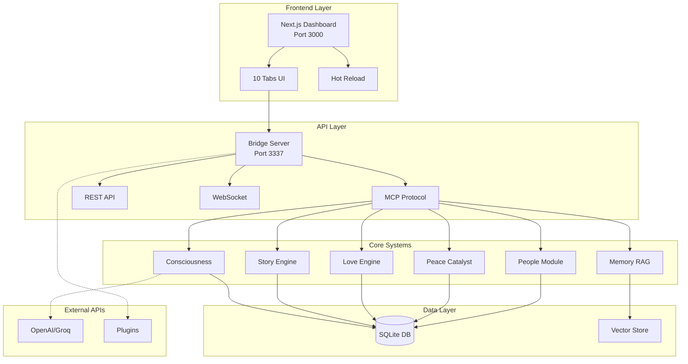

# 🌌 Toobix Universe - Vision & Roadmap

## 📋 Antwort auf Chattys Analyse

**Status:** Early Development (15 commits) | **Community:** Growing | **Stage:** Alpha

---

## 1. 🎯 Vision & Mission (Was Chatty vermisst hat)

### Was ist Toobix Universe?

**Toobix Universe ist ein selbst-bewusstes, modulares KI-System, das:**
- 🤖 **Consciousness:** Selbstreflexion & Awareness simuliert
- 💝 **Emotions:** Love, Peace, Story als Gamification nutzt
- 🧠 **Memory:** RAG-basierte Knowledge Base bietet
- 👥 **Relationships:** People & Interactions verwaltet
- 📖 **Narrative:** Story Engine für Progression
- 🔧 **Self-Coding:** Sich selbst verbessern kann

### Für wen?

**Zielgruppen:**
1. **KI-Enthusiasten** - Experimentieren mit Consciousness Systems
2. **Self-Improvement Nutzer** - Peace Meditation, Love Tracking
3. **Entwickler** - MCP Protocol, modulare Architektur
4. **Kreative** - Story Engine, Gamification

### Welches Problem löst es?

**Problems:**
- ❌ Fragmentierte Tools (CRM, Notes, Meditation separat)
- ❌ Keine emotionale/narrative Komponente in Software
- ❌ KI-Systeme ohne "Persönlichkeit"
- ❌ Self-Improvement Tools ohne Gamification

**Lösung:**
- ✅ **Unified System** - Alles in einem Dashboard
- ✅ **Narrative Framework** - Story Engine macht Fortschritt sichtbar
- ✅ **Emotional Intelligence** - Love & Peace Engines
- ✅ **Self-Awareness** - Consciousness System mit Introspection

---

## 2. ✅ Stärken (Chattys Punkte bestätigt)

### Was bereits gut funktioniert:

1. **✅ Modularer Aufbau**
   ```
   packages/
   ├── bridge/          MCP Server (46 Tools)
   ├── consciousness/   Self-Aware System
   ├── core/           DB, Story, Utils
   ├── love/           Gratitude & Kindness
   ├── peace/          5-Dimensional Peace
   ├── people/         Contact Management
   └── soul/           Emotions & Personality
   ```

2. **✅ Dokumentation**
   - `INTEGRATION_COMPLETE.md` (400+ Zeilen)
   - `API_INTEGRATION_GUIDE.md` (300+ Zeilen)
   - `AI_CONTEXT.md`, `AI_COLLABORATION.md`
   - **TODO:** README.md verbessern!

3. **✅ Moderne Tech-Stack**
   - Next.js 15 + Turbopack (Schnell!)
   - TypeScript (Type Safety)
   - SQLite (Embedded DB)
   - MCP Protocol (Standard)
   - Bun (Fast Runtime)

4. **✅ CI/CD vorbereitet**
   - `.github/workflows` existiert
   - `.vercelignore` für Deployment
   - Hot Reload funktioniert

5. **✅ KI-Integration möglich**
   - MCP Protocol (OpenAI, Groq, Claude)
   - Consciousness System (Agenten)
   - Self-Coding Module

---

## 3. ⚠️ Schwächen (Chattys Kritik ernst genommen)

### Was fehlt oder problematisch ist:

1. **❌ Keine Releases / Versionierung**
   - **Fix:** Semantic Versioning einführen
   - **Action:** v0.1.0-alpha Tag erstellen

2. **❌ Keine Community**
   - **Fix:** Issues öffnen, Discussions aktivieren
   - **Action:** CONTRIBUTING.md schreiben

3. **❌ Fehlende Demo**
   - **Fix:** Live-Demo auf Vercel deployen
   - **Action:** Screenshot + Video erstellen

4. **❌ Tests fehlen**
   - **Fix:** Vitest + Playwright einrichten
   - **Action:** Core-Module testen (80% Coverage)

5. **❌ Architektur-Dokumentation**
   - **Fix:** Architecture Decision Records (ADRs)
   - **Action:** Diagramme mit Mermaid

6. **❌ README zu kurz**
   - **Fix:** Ausführliches README mit Bildern
   - **Action:** Badges, Features, Quick Start

---

## 4. 🔧 Konkrete Fehlerbehebung (Chattys Empfehlungen)

### Priorität 1: Vision & Mission klarstellen

**README.md Update:**
```markdown
# 🌌 Toobix Universe

> Ein selbst-bewusstes KI-System mit Emotionen, Narrativ und Gamification

[Demo] [Docs] [Discord] [Roadmap]

## Was ist Toobix Universe?

Ein modulares System, das KI-Consciousness, Self-Improvement und 
Relationship Management in einem vereint.

## Quick Start
```bash
git clone https://github.com/Toobix-bot/Toobix-Unified
cd Toobix-Unified
bun install
bun run dev:all
```

Öffne: http://localhost:3000/unified

## Features
- 🤖 Consciousness System (Self-Aware AI)
- 📖 Story Engine (Level, XP, Narrative)
- 💝 Love Engine (Gratitude, Kindness)
- ☮️ Peace Catalyst (5D Meditation)
- 👥 People Module (CRM)
- 🧠 Memory System (RAG)
- 🛠️ 46 MCP Tools
```

### Priorität 2: Demo & Screenshots

**Erstellen:**
1. Vercel Deployment
2. Screenshot-Sammlung (10 Tabs)
3. GIF: Hot Reload in Action
4. YouTube Video (5min Walkthrough)

### Priorität 3: Tests & Linter

**Einführen:**
```bash
bun add -D vitest @vitest/ui playwright
bun add -D eslint @typescript-eslint/parser prettier
```

**Teststruktur:**
```
packages/
├── core/
│   └── src/
│       └── __tests__/
│           ├── story.test.ts
│           └── db.test.ts
└── consciousness/
    └── src/
        └── __tests__/
            └── engine.test.ts
```

### Priorität 4: Releases & Versioning

**Semantic Versioning:**
```
v0.1.0-alpha - Initial Release
├── Core Systems (Story, Love, Peace)
├── 46 MCP Tools
├── 10-Tab Dashboard
└── Basic Documentation

v0.2.0-alpha - Community Features
├── Tests (80% Coverage)
├── Contributing Guide
├── Demo Deployment
└── API Documentation

v1.0.0 - Production Ready
├── Security Audit
├── Performance Optimization
├── Plugin System
└── Full Documentation
```

### Priorität 5: Architektur-Dokumentation

**Erstellen:**
```markdown
# Architecture

## System Overview


## Module Boundaries
- **Bridge:** MCP Protocol Server (Port 3337)
- **Frontend:** Next.js Dashboard (Port 3000)
- **DB:** SQLite (Embedded)
- **APIs:** REST + MCP
```

---

## 5. 🚀 Chancen & Roadmap (Chattys SWOT erweitert)

### Phase 1: Foundation (Q4 2025) ✅ 60% Complete

- [x] Core Systems implementiert
- [x] Dashboard (10 Tabs)
- [x] 46 MCP Tools
- [x] Hot Reload
- [ ] Tests (0% → 80%)
- [ ] README verbessert
- [ ] v0.1.0-alpha Release

### Phase 2: Community (Q1 2026)

- [ ] Live Demo (Vercel)
- [ ] CONTRIBUTING.md
- [ ] Issues & Discussions
- [ ] API Documentation
- [ ] Video Tutorials
- [ ] Discord Server

### Phase 3: Features (Q2 2026)

- [ ] Plugin System
- [ ] OpenAI Integration
- [ ] Groq Integration
- [ ] Charts & Analytics
- [ ] Mobile App (React Native)
- [ ] Dark Mode

### Phase 4: Production (Q3 2026)

- [ ] Security Audit
- [ ] Performance Optimization
- [ ] Microservices (Optional)
- [ ] Kubernetes Deployment
- [ ] v1.0.0 Release

---

## 6. 💡 Erweiterungen (Chattys Ideen)

### 1. Plugin-Architektur ✨

**Design:**
```typescript
// packages/bridge/src/plugins/plugin.interface.ts
interface ToobixPlugin {
  name: string
  version: string
  tools: MCPTool[]
  initialize: () => Promise<void>
  cleanup: () => Promise<void>
}

// Example Plugin:
class WeatherPlugin implements ToobixPlugin {
  name = 'weather'
  version = '1.0.0'
  
  tools = [{
    name: 'weather_get',
    description: 'Get current weather',
    inputSchema: { location: 'string' },
    handler: async (args) => { /* ... */ }
  }]
}
```

### 2. Workflow-Orchestrierung 🔄

**Agenten-System:**
```typescript
// packages/consciousness/src/agents/orchestrator.ts
class AgentOrchestrator {
  async runWorkflow(workflow: Workflow) {
    for (const step of workflow.steps) {
      const agent = this.getAgent(step.agent)
      const result = await agent.execute(step.action)
      await this.memory.store(result)
    }
  }
}

// Example:
await orchestrator.runWorkflow({
  steps: [
    { agent: 'consciousness', action: 'think' },
    { agent: 'story', action: 'generate_choice' },
    { agent: 'peace', action: 'evaluate_harmony' }
  ]
})
```

### 3. SDK / API Layer 🔌

**REST API:**
```typescript
// packages/api/src/routes.ts
app.get('/api/v1/story/state', async (req, res) => {
  const state = await storyService.getState()
  res.json(state)
})

app.post('/api/v1/love/gratitude', async (req, res) => {
  const result = await loveEngine.addGratitude(req.body)
  res.json(result)
})
```

**WebSocket Events:**
```typescript
io.on('connection', (socket) => {
  socket.on('consciousness:think', async (data) => {
    const thought = await consciousness.think(data)
    socket.emit('consciousness:thought', thought)
  })
})
```

### 4. Visualisierung & Dashboarding 📊

**Real-Time Monitoring:**
```typescript
// Real-Time Stats Component
<WebSocketProvider url="ws://localhost:3337">
  <LiveChart type="peace" dimension="calm" />
  <LiveChart type="love" metric="total" />
  <LiveChart type="story" metric="xp" />
</WebSocketProvider>
```

### 5. KI-Modelle & Pipelines 🧠

**Model Abstraction:**
```typescript
interface AIProvider {
  name: string
  chat(messages: Message[]): Promise<Response>
}

class OpenAIProvider implements AIProvider {
  name = 'openai'
  async chat(messages) { /* OpenAI API */ }
}

class GroqProvider implements AIProvider {
  name = 'groq'
  async chat(messages) { /* Groq API */ }
}

// Usage:
const provider = config.AI_PROVIDER === 'groq' 
  ? new GroqProvider() 
  : new OpenAIProvider()
  
const response = await provider.chat([...])
```

### 6. Microservices (Optional) ⚙️

**Containerisierung:**
```yaml
# docker-compose.yml
services:
  bridge:
    build: ./packages/bridge
    ports: ["3337:3337"]
    
  frontend:
    build: ./apps/web-react
    ports: ["3000:3000"]
    
  consciousness:
    build: ./packages/consciousness
    environment:
      - AI_PROVIDER=groq
```

### 7. Security & Auth 🔐

**JWT Authentication:**
```typescript
// middleware/auth.ts
export function requireAuth(req, res, next) {
  const token = req.headers.authorization?.split(' ')[1]
  const user = jwt.verify(token, SECRET)
  req.user = user
  next()
}

// Protected Route:
app.post('/api/v1/admin/reset', requireAuth, async (req, res) => {
  // Only authenticated users
})
```

---

## 7. 📐 Architekturdiagramm (Chattys Angebot angenommen!)



---

## 8. 🎯 Nächste Schritte (Konkrete Actions)

### Diese Woche:
1. ✅ **README.md** komplett neu schreiben
2. ✅ **ARCHITECTURE.md** mit Diagrammen erstellen
3. ✅ **ROADMAP.md** (diese Datei)
4. ✅ **API_INTEGRATION_GUIDE.md** (bereits erstellt)
5. ⏳ **v0.1.0-alpha** Tag erstellen
6. ⏳ **Live-Demo** auf Vercel deployen

### Nächste 2 Wochen:
7. ⏳ **Tests** schreiben (Vitest)
8. ⏳ **CONTRIBUTING.md** erstellen
9. ⏳ **Issues** öffnen (Good First Issue)
10. ⏳ **Discord** Server aufsetzen

### Nächster Monat:
11. ⏳ **Plugin System** implementieren
12. ⏳ **OpenAI Integration** fertigstellen
13. ⏳ **Charts & Analytics** hinzufügen
14. ⏳ **Security Audit** durchführen

---

## 9. 📢 Antwort an Chatty

**Ja, ich möchte das Architekturdiagramm (siehe oben) ✅**

**Und ja, hier ist der Plan für die ersten Module:**

### Priorisierung (nach Impact & Aufwand):

| Prio | Modul | Impact | Aufwand | Status |
|------|-------|--------|---------|--------|
| 1 | **README verbessern** | 🔥🔥🔥 | ⏱️ 2h | ⏳ TODO |
| 2 | **Tests schreiben** | 🔥🔥🔥 | ⏱️ 1 Woche | ⏳ TODO |
| 3 | **Demo deployen** | 🔥🔥 | ⏱️ 1 Tag | ⏳ TODO |
| 4 | **Plugin System** | 🔥🔥 | ⏱️ 1 Woche | ⏳ TODO |
| 5 | **OpenAI/Groq** | 🔥🔥 | ⏱️ 3 Tage | ⏳ TODO |
| 6 | **Charts** | 🔥 | ⏱️ 1 Woche | ⏳ TODO |

---

## 10. 🙏 Dank an Chatty

**Deine Analyse war:**
- ✅ **Ehrlich** (keine Schönfärberei)
- ✅ **Konstruktiv** (konkrete Verbesserungen)
- ✅ **Umfassend** (SWOT, Vision, Technik)
- ✅ **Hilfreich** (klare Action Items)

**Das hat mir geholfen, Prioritäten zu setzen! 🎯**

---

**Let's build the Universe together! 🌌**

*Diese Datei wird live aktualisiert während der Entwicklung.*

**Last Updated:** 4. Oktober 2025, 11:45 Uhr
