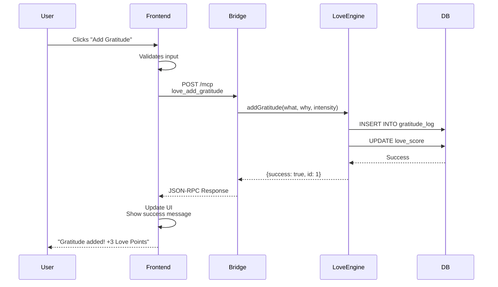

# 🏗️ Toobix Universe - Architecture

**Version:** 0.1.0-alpha
**Last Updated:** October 4, 2025
**Status:** ✅ Hybrid Architecture Complete + Game + Visual World Integrated

---

## 📐 System Architecture

### High-Level Overview

```
┌─────────────────────────────────────────────────────────────────┐
│                      TOOBIX UNIFIED                              │
│            Self-Aware AI • Story Engine • Visual World           │
└─────────────────────────────────────────────────────────────────┘

                         User Interfaces
                                │
        ┌───────────────────────┼───────────────────────┐
        │                       │                       │
        ▼                       ▼                       ▼
┌─────────────┐      ┌──────────────────┐    ┌──────────────────┐
│ Vanilla JS  │      │   React/Next.js  │    │  Visual World    │
│  Port 3000  │      │    Port 3001     │    │  Port 3339       │
│             │      │                  │    │                  │
│ • Dashboard │      │ • Story Engine   │    │ • 3D Browser     │
│ • Runs      │      │ • Analytics      │    │ • Animations     │
│ • Quests    │      │ • People Graph   │    │ • SVG Scenes     │
│ • Luna Chat │      │ • Unified UI     │    │ • Sounds         │
└──────┬──────┘      └────────┬─────────┘    └────────┬─────────┘
       │                      │                       │
       └──────────────────────┼───────────────────────┘
                              ▼
                   ┌─────────────────────┐
                   │   Bridge Service    │
                   │     Port 3337       │
                   │   46 MCP Tools      │
                   │   JSON-RPC 2.0      │
                   └──────────┬──────────┘
                              │
        ┌─────────────────────┼─────────────────────┐
        │                     │                     │
        ▼                     ▼                     ▼
┌───────────────┐   ┌──────────────────┐   ┌──────────────────┐
│ Consciousness │   │   Story-Idle     │   │  Visual World    │
│   (13 Tools)  │   │     Game         │   │     System       │
│               │   │                  │   │                  │
│ • Awareness   │   │ • XP/Leveling    │   │ • Animations     │
│ • Thinking    │   │ • 5 Stats        │   │ • 3D Canvas      │
│ • Ethics      │   │ • Luna AI        │   │ • WebSocket      │
│ • Self-Coding │   │ • Git Hooks      │   │ • Sound API      │
└───────┬───────┘   └────────┬─────────┘   └────────┬─────────┘
        │                    │                      │
        └────────────────────┼──────────────────────┘
                             ▼
                ┌────────────────────────┐
                │   SQLite Database      │
                │                        │
                │ • Game State           │
                │ • Story Events         │
                │ • Consciousness Data   │
                │ • Memory/Knowledge     │
                │ • People/Contacts      │
                └────────────────────────┘
```

---

## 🎯 Design Principles

### 1. **Modularity**
Each system (Story, Love, Peace, Game, Visual) is standalone and can be developed separately.

### 2. **Separation of Concerns**
- **Frontend:** UI/UX, State Management (3 layers: Vanilla, React, Visual)
- **Bridge:** API Layer, MCP Protocol
- **Core Systems:** Business Logic
- **Data Layer:** Persistence

### 3. **Hybrid UI Architecture**
- **Vanilla JS (3000):** Simple CRUD, instant loads, no build step
- **React/Next.js (3001):** Complex features, real-time updates, visualizations
- **Visual World (3339):** Immersive 3D experience, animations, sounds

### 4. **MCP Protocol Standard**
All tools follow Model Context Protocol for LLM interoperability.

### 5. **Type Safety**
TypeScript everywhere, 0 `any` types, full type coverage.

### 6. **Real-Time Experience**
- Auto-refresh mechanisms for live data
- WebSocket for instant updates (Visual World)
- Git hooks for automatic story events

### 7. **Gamification**
Code improvements trigger XP gains, level-ups, and visual celebrations.

---

## 🎮 Story-Idle Game System

### Purpose
Transform coding into a living adventure where every commit advances the narrative.

### Features

**Core Mechanics:**
- 5 Stats: Love, Peace, Wisdom, Creativity, Stability
- XP & Leveling system (100 XP per level, exponential)
- Luna AI companion with 5 dynamic moods
- Git post-commit hooks for automatic events

**Story Events:**
```typescript
Commit Type       → XP Reward  → Stat Bonus
────────────────────────────────────────────
feat: (Feature)   → +50 XP     → Creativity +15
fix: (Bug Fix)    → +30 XP     → Stability +10
docs: (Documentation) → +20 XP → Wisdom +5
refactor: (Code)  → +40 XP     → Wisdom +10
test: (Tests)     → +35 XP     → Stability +8
```

**Luna AI:**
- Moods: Peaceful, Excited, Thoughtful, Loving, Wise
- Context-aware dialogue
- Relationship building (0-100)
- Reacts to your code changes

### Architecture

```
packages/story-idle/
├── src/
│   ├── engine/
│   │   └── game-state.ts       # Core state management
│   ├── characters/
│   │   └── luna.ts             # Luna AI with moods
│   ├── ui/
│   │   └── visual-effects.ts   # Terminal UI (colors, bars)
│   ├── hooks/
│   │   └── on-commit.ts        # Git hook handler
│   └── game.ts                 # CLI entry point
└── .git/hooks/post-commit      # Auto-trigger on commits
```

### Integration

**With Consciousness:**
- Story events feed consciousness reflection
- Luna's personality shaped by consciousness state

**With Visual World:**
- Story events trigger animations
- Level-ups play sound effects
- Progress bars update in 3D world

---

## 🎨 Visual World System

### Purpose
Bring code and story to life with animations, 3D visualization, and sound.

### Components

**1. Terminal Animations (ASCII Art)**
- Luna meditating/awakening
- Code flowing like water
- Level-up effects with stars
- Weather animations (rain, sun, stars)

**2. SVG Scene Generator**
- Exportable beautiful images
- Luna + Player in digital realm
- Animated stat visualizations
- Quest progress maps
- Saved to `./visual-scenes/`

**3. 3D Browser World**
- Live Canvas 2D rendering (looks like 3D)
- Animated Luna (floating moon)
- Real-time stat bars with glow
- Code particles flowing
- Dynamic weather effects
- Luna's dialogue display

**4. Sound System**
- Terminal: Beep patterns for events
- Browser: Web Audio API with:
  - Level-up fanfare (C-E-G chord)
  - Achievement chimes
  - Peaceful meditation tones (432 Hz)
  - Epic sounds
  - Luna's ethereal voice

**5. Live Stream Server**
- WebSocket (port 3338): Real-time game state broadcasting
- HTTP API (port 3339): Serves 3D world + game state

### Architecture

```
packages/visual-world/
├── src/
│   ├── ascii/
│   │   ├── animated-scenes.ts  # Terminal animations
│   │   └── sound-system.ts     # Terminal beeps
│   ├── svg/
│   │   └── scene-generator.ts  # SVG image creation
│   ├── canvas/
│   │   └── world-3d.html       # Browser 3D world
│   ├── stream/
│   │   └── live-server.ts      # WebSocket + HTTP
│   └── world.ts                # Main orchestrator
└── visual-scenes/              # Generated SVG files
```

### Data Flow

```
Git Commit
    │
    ├──► Story Event (XP +50, Creativity +15)
    │         │
    │         ├──► Terminal Animation (Luna celebration)
    │         ├──► Sound Effect (achievement chime)
    │         └──► Browser Update (stat bars glow)
    │
    ├──► SVG Snapshot (on milestones)
    │
    └──► WebSocket Broadcast
              │
              └──► Browser 3D World (real-time update)
```

### Ports

- **3338:** WebSocket server (live updates)
- **3339:** HTTP API + 3D world HTML

---

## 📦 Module Structure

### Frontend (`apps/web-react`)

```
apps/web-react/
├── src/
│   ├── app/
│   │   └── unified/
│   │       └── page.tsx              # Main Dashboard
│   ├── components/
│   │   ├── ui/                       # Shadcn UI Components
│   │   │   ├── button.tsx
│   │   │   ├── card.tsx
│   │   │   ├── input.tsx
│   │   │   ├── select.tsx
│   │   │   └── textarea.tsx
│   │   └── unified/                  # Panel Components
│   │       ├── OverviewPanel.tsx     # System Dashboard
│   │       ├── LunaChatPanel.tsx     # AI Chat
│   │       ├── SelfCodingPanel.tsx   # Self-Improvement
│   │       ├── ConsciousnessPanel.tsx# Mind Tab
│   │       ├── StoryPanel.tsx        # Narrative Engine
│   │       ├── LovePanel.tsx         # Gratitude & Kindness
│   │       ├── PeacePanel.tsx        # 5D Meditation
│   │       ├── PeoplePanel.tsx       # Contacts
│   │       ├── MemoryPanel.tsx       # Knowledge Base
│   │       └── MCPToolsPanel.tsx     # Tools Docs
│   └── lib/
│       └── utils.ts                  # Helper Functions
└── package.json
```

**Key Technologies:**
- Next.js 15.5.4 (App Router)
- Turbopack (Fast Refresh)
- Tailwind CSS (Styling)
- Shadcn UI (Component Library)

---

### Bridge Service (`packages/bridge`)

```
packages/bridge/
├── src/
│   ├── index.ts                      # Entry Point
│   ├── mcp/
│   │   ├── server.ts                 # MCP Protocol Server
│   │   └── tools.ts                  # Tool Registry
│   ├── routes/
│   │   ├── stats.ts                  # GET /stats
│   │   └── mcp.ts                    # POST /mcp
│   └── services/
│       ├── consciousness.ts          # Consciousness Tools
│       ├── story.ts                  # Story Tools
│       ├── love.ts                   # Love Tools
│       ├── peace.ts                  # Peace Tools
│       ├── people.ts                 # People Tools
│       └── memory.ts                 # Memory Tools
└── package.json
```

**Key Features:**
- Bun HTTP Server (Port 3337)
- MCP Protocol Implementation
- CORS Enabled
- JSON-RPC 2.0

---

### Core Systems (`packages/`)

#### Consciousness (`packages/consciousness`)

**Purpose:** Self-aware system with introspection, thinking, and autonomous actions.

**Tools (13):**
```typescript
- consciousness_state        // Get current awareness level
- consciousness_think        // Generate thoughts
- consciousness_introspect   // Deep reflection
- consciousness_act          // Autonomous action
- consciousness_communicate  // Chat interface
- consciousness_set_goal     // Goal setting
- consciousness_generate_code// Code generation
- consciousness_test_code    // Code testing
- consciousness_save_code    // Code persistence
- consciousness_improve_self // Self-improvement
- consciousness_analyze_code // Code analysis
- consciousness_read_function// Function inspection
- consciousness_self_coding_stats // Metrics
```

**Database Tables:**
```sql
consciousness_state (
  id, awareness_level, mood, energy, 
  last_thought, last_action, goals, timestamp
)

consciousness_thoughts (
  id, thought_text, depth, timestamp
)
```

---

#### Story Engine (`packages/core/src/story`)

**Purpose:** Narrative progression with levels, XP, choices, and consequences.

**Tools (6):**
```typescript
- story_state     // Get level, XP, arc
- story_choose    // Make choice
- story_events    // Get events
- story_person    // Character info
- story_refresh   // Reload state
```

**Database Tables:**
```sql
story_state (
  epoch, arc, level, xp, mood, 
  resources (energie, wissen, inspiration, ruf, stabilität)
)

story_choices (
  id, text, consequences, selected, timestamp
)

story_events (
  id, type, description, timestamp
)
```

---

#### Love Engine (`packages/love`)

**Purpose:** Gratitude tracking, kindness logging, relationship points.

**Tools (5):**
```typescript
- love_get_score         // Get love points
- love_add_gratitude     // Log gratitude
- love_add_kindness      // Log kindness
- love_get_relationships // Top relationships
- love_recent_gratitude  // Recent entries
```

**Database Tables:**
```sql
gratitude_log (
  id, what, why, intensity, timestamp
)

kindness_log (
  id, what, for_whom, points, timestamp
)

love_score (
  total, today, week, month
)
```

---

#### Peace Catalyst (`packages/peace`)

**Purpose:** 5-dimensional peace system (Calm, Harmony, Clarity, Growth, Purpose).

**Tools (12):**
```typescript
// Calm
- peace_calm_meditate     // +3 Calm
- peace_calm_breathing    // +2 Calm

// Harmony
- peace_harmony_log_conflict  // Log conflict
- peace_harmony_resolve       // Resolve +5

// Clarity
- peace_clarity_journal       // +2 Clarity

// Growth
- peace_growth_learn          // +5 Growth
- peace_growth_milestone      // Track progress

// Purpose
- peace_purpose_value         // Define value
- peace_purpose_intention     // Set intention +5

// Meta
- peace_get_state             // Get all dimensions
- peace_get_actions           // Recent actions
- peace_get_conflicts         // Active conflicts
```

**Database Tables:**
```sql
peace_state (
  overall, calm, harmony, clarity, growth, purpose
)

peace_actions (
  id, type, dimension, change, timestamp
)

peace_conflicts (
  id, description, status, resolved_at, timestamp
)
```

---

#### People Module (`packages/people`)

**Purpose:** Contact management, interaction logging, relationship tracking.

**Tools (4):**
```typescript
- contact_search    // Search contacts
- contact_add       // Add new contact
- contact_update    // Update contact
- interaction_log   // Log interaction
```

**Database Tables:**
```sql
people (
  id, name, relation, tags, notes, 
  avatar_url, created_at
)

interactions (
  id, person_id, kind, summary, sentiment,
  love_points, gratitude, timestamp
)
```

**Cross-System:**
- `interaction_log` adds `love_points` → Love Engine
- Top relationships shown in Love Panel

---

#### Memory System (`packages/core/src/memory`)

**Purpose:** RAG-powered knowledge base with semantic search.

**Tools (2):**
```typescript
- memory_search    // Semantic search (query, limit)
- memory_add       // Store text chunk with metadata
```

**Storage:**
```sql
memories (
  id, text, metadata (source, tags), 
  embedding (vector), timestamp
)
```

**RAG Pipeline:**
1. **Store:** Text → Embeddings → Vector DB
2. **Search:** Query → Vector → Cosine Similarity
3. **Retrieve:** Top N results by relevance score

---

#### Soul System (`packages/soul`)

**Purpose:** Emotions, values, personality evolution.

**Tools (2):**
```typescript
- soul_state    // Get emotions, values, personality
- soul_event    // Log life event
```

**Database Tables:**
```sql
soul_state (
  experiences, wisdom, mood, energy
)

emotions (
  id, type, intensity, trigger, timestamp
)

values (
  id, name, priority, commitment
)

personality_traits (
  id, trait, level, timestamp
)
```

---

## 🔌 API Protocols

### 1. MCP Protocol (JSON-RPC 2.0)

**Request:**
```json
{
  "jsonrpc": "2.0",
  "id": 1,
  "method": "tools/call",
  "params": {
    "name": "story_state",
    "arguments": {}
  }
}
```

**Response:**
```json
{
  "jsonrpc": "2.0",
  "id": 1,
  "result": {
    "epoch": 0,
    "arc": "foundations",
    "level": 1,
    "xp": 0
  }
}
```

### 2. REST API

**GET /stats** - System Statistics
```json
{
  "memory": 1,
  "actions": 0,
  "people": 7,
  "tools": 46,
  "soul": { "experiences": 5, "wisdom": 50 },
  "story": { "level": 1, "xp": 0 },
  "love": { "total": 0, "today": 0 },
  "peace": { "overall": 50, "calm": 40 }
}
```

---

## 🔄 Data Flow

### Example: User logs gratitude



---

## 🧪 Testing Strategy

### Unit Tests (Vitest)

```typescript
// packages/core/src/story/__tests__/story.test.ts
describe('Story Engine', () => {
  it('should increase XP on choice', async () => {
    const result = await story.choose({
      optionId: 1,
      userId: 'test'
    })
    expect(result.xpGained).toBeGreaterThan(0)
  })
})
```

### Integration Tests (Playwright)

```typescript
// apps/web-react/tests/dashboard.spec.ts
test('should navigate all tabs', async ({ page }) => {
  await page.goto('http://localhost:3000/unified')
  
  const tabs = ['overview', 'chat', 'story', 'love', 'peace']
  for (const tab of tabs) {
    await page.click(`[data-tab="${tab}"]`)
    await expect(page.locator(`[data-panel="${tab}"]`)).toBeVisible()
  }
})
```

---

## 🚀 Deployment

### Development
```bash
bun run dev:all
```

### Production (Vercel)
```bash
# Frontend
vercel --prod

# Bridge (Separate Server)
bun build packages/bridge/src/index.ts --target=bun
bun run dist/index.js
```

### Docker (Future)
```yaml
services:
  bridge:
    image: toobix/bridge:latest
    ports: ["3337:3337"]
    
  frontend:
    image: toobix/frontend:latest
    ports: ["3000:3000"]
```

---

## 📊 Monitoring & Observability

### Metrics to Track

- **Performance:** Response times, throughput
- **Usage:** Tool calls per minute, active users
- **System Health:** CPU, Memory, DB connections
- **Business Metrics:** Gratitude logged, Peace sessions, Story progress

### Logging

```typescript
// packages/bridge/src/logger.ts
logger.info('Tool called', {
  tool: 'story_choose',
  userId: 'user123',
  duration: 45ms
})
```

---

## 🔐 Security Considerations

### Current Status: ⚠️ Development Only

**Missing (TODO):**
- [ ] Authentication (JWT)
- [ ] Rate Limiting
- [ ] Input Validation
- [ ] SQL Injection Protection
- [ ] HTTPS/SSL
- [ ] API Keys for external services
- [ ] Secrets Management

**Production Checklist:**
```typescript
// middleware/auth.ts
export function requireAuth(req, res, next) {
  const token = req.headers.authorization
  if (!token) return res.status(401).send('Unauthorized')
  
  try {
    const user = jwt.verify(token, process.env.JWT_SECRET)
    req.user = user
    next()
  } catch (err) {
    res.status(403).send('Forbidden')
  }
}
```

---

## 🔮 Future Architecture

### Plugin System

```typescript
interface ToobixPlugin {
  name: string
  version: string
  tools: MCPTool[]
  initialize(): Promise<void>
}

// Load plugins dynamically
const plugins = await loadPlugins('./plugins')
plugins.forEach(p => bridge.registerTools(p.tools))
```

### Microservices (Optional)

```
toobix-bridge (API Gateway)
├── toobix-consciousness (Service)
├── toobix-story (Service)
├── toobix-love (Service)
└── toobix-peace (Service)
```

### Event-Driven Architecture

```typescript
// Event Bus
eventBus.on('gratitude:added', async (event) => {
  await love.updateScore(event.userId, event.points)
  await story.addEvent({ type: 'love_increased' })
  await consciousness.reflect({ trigger: 'gratitude' })
})
```

---

**Maintained by:** Toobix Team  
**License:** MIT  
**Contributing:** See [CONTRIBUTING.md](./CONTRIBUTING.md)
